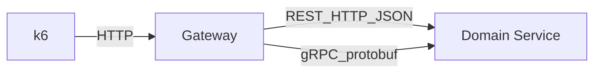

## Target architecture

- **Domain Service**: provides a single “get data” operation over both REST and gRPC.
- **Gateway**: exposes two public endpoints that do the same work but call Domain Service differently:
  - REST path: Gateway →(HTTP/JSON)→ Domain Service
  - gRPC path: Gateway →(gRPC/protobuf)→ Domain Service
- **k6**: calls Gateway only, so the test measures end-to-end including Gateway server + Gateway→Domain Service client + Domain Service server.

## Repo/layout changes (no execution yet)

- Add 2 Maven modules under the existing root aggregator `pom.xml`:
  - `spring-rest-grpc-service-a/`
  - `spring-rest-grpc-service-b/`
- Add a shared proto file **outside** Maven modules so you still have exactly 2 subprojects:
  - `proto/demo.proto`

## Domain Service implementation

- REST API (Spring MVC)
  - `GET /domain-service/data?sizeBytes=...&id=...`
  - returns deterministic payload (e.g., `{ "id": "...", "payload": "<sizeBytes>" }`) so payload size is controllable.
- gRPC server
  - `DemoService/GetData(GetDataRequest) returns (GetDataResponse)`
  - same fields/behavior as REST.
- Config
  - run on `server.port=8082`
  - gRPC on `grpc.server.port=9092`

## Gateway implementation

- REST controller with two endpoints:
  - `GET /gateway/rest?sizeBytes=...&id=...` calls Domain Service REST and returns result
  - `GET /gateway/grpc?sizeBytes=...&id=...` calls Domain Service gRPC and returns result (still JSON to caller)
- Clients
  - REST client via `WebClient` (or `RestTemplate` to match Boot 2.2 defaults; we’ll pick one and keep it consistent)
  - gRPC client via `net.devh:grpc-client-spring-boot-starter`
- Config
  - run on `server.port=8081`
  - configure Domain Service base URL + gRPC target (`static://localhost:9092`)

## Build tooling

- Keep consistent with your repo’s baseline: Spring Boot **2.2.4.RELEASE** and Java **8**.
- In both modules’ `pom.xml`:
  - Spring Boot web dependencies
  - gRPC + protobuf generation via `protobuf-maven-plugin`
  - `net.devh:grpc-server-spring-boot-starter` (B) and `net.devh:grpc-client-spring-boot-starter` (A)
  - Put generated sources under `target/generated-sources` and attach to compilation.

## k6 benchmark

- Add `k6/rest_vs_grpc.js` that:
  - ramps VUs (configurable)
  - runs two scenarios (or two separate runs): hit `/gateway/rest` vs `/gateway/grpc`
  - collects p50/p90/p99 latency, req/s, and error rate.
- Example run workflow (later, when executing):
  - start Domain Service, then Gateway
  - `k6 run k6/rest_vs_grpc.js` with env vars for base URL, payload size, duration, vus.

## Verification

- Manual smoke checks:
  - curl both Gateway endpoints and confirm outputs match for same inputs.
- Quick local benchmark:
  - run k6 twice (REST-only and gRPC-only) using same VUs/duration/payload size.

## Files you can expect to be added/changed

- Root: `[pom.xml](pom.xml)` add the two new modules
- New:
  - `[spring-rest-grpc-service-a/pom.xml](spring-rest-grpc-service-a/pom.xml)`
  - `[spring-rest-grpc-service-b/pom.xml](spring-rest-grpc-service-b/pom.xml)`
  - `[proto/demo.proto](proto/demo.proto)`
  - Spring Boot apps/controllers/configs under each module’s `src/main/java/...`
  - Config under each module’s `src/main/resources/application.yml`
  - `[k6/rest_vs_grpc.js](k6/rest_vs_grpc.js)`

