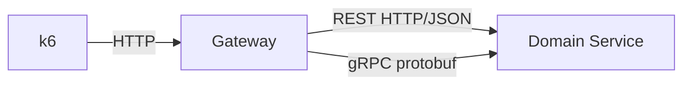

# Spring REST vs gRPC Comparison

This project compares REST and gRPC performance in the same business flow using two Spring Boot services:

- `Gateway`: public HTTP entry point for benchmark traffic.
- `Domain Service`: data provider exposing both REST and gRPC with identical behavior.
- `k6`: load generator that calls only Gateway to measure end-to-end latency and throughput.

The goal is to compare `p50/p90/p99`, `req/s`, and error rate while keeping application logic and payload size the same.

## Architecture

Two execution paths are implemented with the same semantics:

- REST path: `k6 -> Gateway (/gateway/rest) -> Domain Service REST (/domain-service/data)`
- gRPC path: `k6 -> Gateway (/gateway/grpc) -> Domain Service gRPC (DemoService/GetData)`



## How it is implemented

### Domain Service (`spring-rest-grpc-service-b`)

Domain Service provides one "get data" operation through two protocols:

- REST: `GET /domain-service/data?id=...&sizeBytes=...` on port `8082`
- gRPC: `DemoService/GetData` on port `9092`

Both endpoints produce the same output contract: `id` and a deterministic payload of `sizeBytes` characters.

### Gateway (`spring-rest-grpc-service-a`)

Gateway exposes two public HTTP endpoints on port `8081`:

- `GET /gateway/rest?id=...&sizeBytes=...` -> calls Domain Service via REST
- `GET /gateway/grpc?id=...&sizeBytes=...` -> calls Domain Service via gRPC

Both endpoints return the same JSON shape (`id`, `payload`) so protocol overhead can be compared fairly.

### Shared gRPC contract

`proto/demo.proto` defines:

- `GetDataRequest { id, sizeBytes }`
- `GetDataResponse { id, payload(bytes) }`
- `DemoService/GetData`

### Benchmark script

`k6/rest_vs_grpc.js` supports configurable environment variables:

- `MODE=rest|grpc`
- `BASE_URL` (default: `http://localhost:8081`)
- `SIZE_BYTES`
- `VUS`
- `DURATION`

## Requirements

- JDK 8
- Maven 3.6+
- Docker (to run `k6` container)

## Build

Run from repository root (`spring-grpc`):

```bash
mvn clean package
```

If you only want to generate protobuf/grpc sources:

```bash
mvn -pl spring-grpc/spring-rest-grpc-service-b,spring-grpc/spring-rest-grpc-service-a generate-sources
```

If `os-maven-plugin` permission issues happen:

```bash
rm -rf ~/.m2/repository/kr/motd/maven/os-maven-plugin
mvn -pl spring-grpc/spring-rest-grpc-service-b,spring-grpc/spring-rest-grpc-service-a generate-sources
```

## Run services

### 1) Start Domain Service

```bash
mvn -pl spring-grpc/spring-rest-grpc-service-b spring-boot:run
```

Quick smoke test:

```bash
curl "http://localhost:8082/domain-service/data?id=test&sizeBytes=16"
```

### 2) Start Gateway (new terminal)

```bash
mvn -pl spring-grpc/spring-rest-grpc-service-a spring-boot:run
```

Smoke test both paths:

```bash
curl "http://localhost:8081/gateway/rest?id=test&sizeBytes=16"
curl "http://localhost:8081/gateway/grpc?id=test&sizeBytes=16"
```

Expected: both responses have the same `id`, and `payload.length == sizeBytes`.

## Run k6 comparison

Run from repository root (`spring-example`).

### Run 1: REST path

```bash
docker run --rm -i \
  -v "$PWD/spring-grpc/k6:/scripts" \
  grafana/k6 run \
  -e BASE_URL=http://host.docker.internal:8081 \
  -e MODE=rest \
  -e SIZE_BYTES=102400 \
  -e VUS=50 \
  -e DURATION=30s \
  /scripts/rest_vs_grpc.js
```

### Run 2: gRPC path (through Gateway)

```bash
docker run --rm -i \
  -v "$PWD/spring-grpc/k6:/scripts" \
  grafana/k6 run \
  -e BASE_URL=http://host.docker.internal:8081 \
  -e MODE=grpc \
  -e SIZE_BYTES=102400 \
  -e VUS=50 \
  -e DURATION=30s \
  /scripts/rest_vs_grpc.js
```

Compare these metrics between the two runs:

- `http_req_duration` (`p50/p90/p99`)
- `http_reqs` (throughput)
- `checks` / error rate

## Fair benchmark checklist

- Keep `SIZE_BYTES`, `VUS`, and `DURATION` identical across runs.
- Change only `MODE` (`rest` vs `grpc`).
- Run multiple rounds and compare medians if results fluctuate.
